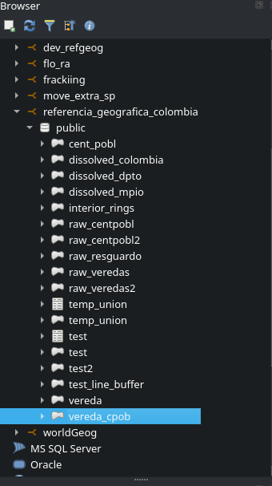

# Connecting the database to Qgis: example in the Humboldt institute
Marius Bottin

In this document we will show how to connect Qgis to the database.

Open Qgis and look for the PostgreSQL option in the browser, right
click, new connection:

Next enter the following configuration (this should work in the Humboldt
institute network and through the institute vpn).

Now you may browse the database:

Note, this is a development database, there are a lot of objects which
are there because I worked dirty… The most interesting object is the
`vereda_cpob` one!
