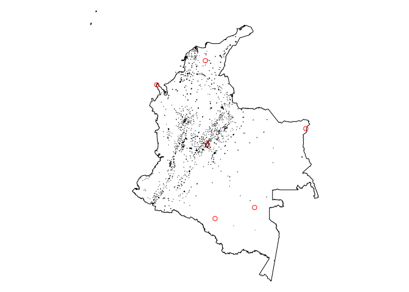

# Extracting administrative locations
Marius Bottin

- [Main function](#main-function)
  - [R](#r)
  - [Python](#python)
- [Concrete use of the database](#concrete-use-of-the-database)
  - [In R](#in-r)
- [Closing connection](#closing-connection)

In this document we will show how to extract administrative levels
(country, department, municipality, vereda) of locations from the
database that have been created from the codes in the
[database_creation](../database_creation) directory.

Later we may treat as well the cases of polygons or lines, but since
those objects may be in more than one vereda, we will only treat here
the case of points.

## Main function

The main function consists in importing a temporary spatial table with
the points in the database, make the spatial join with the vereda layer
in there and send back the resulting administrative polygons it
intersects with. Note that this way of doing things might be the most
efficient for large points dataset, but not for a few points.

### R

In R the function is:

``` r
# ptsOnColombia_adm checks on which administrative geographic elements are
# points given in a sf spatial object arguments: pts: sf object with all the
# points that need to be checked dbConn: connection to the reference database
# (note that this database needs to have particular table, with particular
# fields), it needs to use the RPostgres::Postgres() driver id: id for
# returning results, it may be a column name of the sf object (needs to be
# unique) if it is NA, an id column is created with 1:nrow(pts) DWithin: if
# this is not NA, it should contain a distance in meter, the function will then
# return a supplentary column with the dane cd and names of other elements at
# this distance indexing: should the temporary table with the points in the
# database be spatially indexed (may speed up the process for large datasets)

ptsOnColombia_adm <- function(pts, dbConn, id = NA, DWithin = NA, indexing = F) {
    # daneOrName <- match.arg(daneOrName,c('both','names','dane'))
    createId <- is.na(id)
    if (createId) {
        pts <- st_sf(id = 1:nrow(pts), st_geometry(pts))
        id <- "id"
    } else {
        if (!id %in% colnames(pts)) {
            stop("Given id column is not in the data")
        }
        if (any(duplicated(pts[, id, drop = T]))) {
            stop("Given ids are not unique")
        }
        pts <- pts[, id, drop = F]
    }
    pts <- st_set_geometry(pts, "geom")
    dbSrid <- st_crs(dbGetQuery(dbConn, "SELECT Find_SRID('public','vereda_cpob','the_geom') as srid")$srid)
    ptsSrid <- st_crs(pts)
    sameSrid <- (dbSrid == ptsSrid)
    dbBegin(dbConn)
    st_geometry(pts) <- "geom"
    geom <- "geom"
    st_write(dsn = dbConn, obj = pts, layer = "pts", temporary = T)
    if (!sameSrid) {
        dbExecute(dbConn, "SELECT AddGeometryColumn('pts','tr_geom',(SELECT Find_SRID('public','vereda_cpob','the_geom')),'POINT',2)")
        dbExecute(dbConn, "UPDATE pts SET tr_geom=ST_Transform(geom,(SELECT Find_SRID('public','vereda_cpob','the_geom')))")
        geom <- "tr_geom"
    }
    if (indexing) {
        dbExecute(dbConn, paste0("CREATE INDEX pts_spat_idx ON ", dbQuoteIdentifier(dbConn,
            Id(table = "pts")), " USING GIST(", dbQuoteIdentifier(dbConn, geom),
            ")"))
    }
    (q_select <- paste0("SELECT ", paste(dbQuoteIdentifier(dbConn, Id(table = "pts",
        column = id)), "CASE 
                            WHEN vereda_cpob.cd_ver IS NULL AND vereda_cpob.cd_cpob IS NOT NULL THEN 'centro poblado'
                            WHEN vereda_cpob.cd_ver IS NOT NULL AND vereda_cpob.cd_cpob IS NULL THEN 'vereda'
                            ELSE 'not found'
                          END AS \"type_found\"",
        dbQuoteIdentifier(dbConn, Id(table = "vereda_cpob", column = "cd_ver")),
        dbQuoteIdentifier(dbConn, Id(table = "vereda_cpob", column = "cd_cpob")),
        paste(dbQuoteIdentifier(dbConn, Id(table = "vereda_cpob", column = "name")),
            dbQuoteIdentifier(dbConn, "vereda_cpob"), sep = " AS "), dbQuoteIdentifier(dbConn,
            Id(table = "municipio", column = "cd_mpio")), dbQuoteIdentifier(dbConn,
            Id(table = "municipio", column = "municipio")), dbQuoteIdentifier(dbConn,
            Id(table = "departamento", column = "cd_dpto")), dbQuoteIdentifier(dbConn,
            Id(table = "departamento", column = "departamento")), dbQuoteIdentifier(dbConn,
            Id(table = "vereda_cpob", column = "fuente")), sep = ", ")))
    if (!is.na(DWithin)) {
        q_select <- paste0(q_select, ", ST_Distance(", dbQuoteIdentifier(dbConn,
            Id(table = "pts", column = geom)), ",", dbQuoteIdentifier(dbConn, Id(table = "vereda_cpob",
            column = "the_geom")), ",true) distance_m")
    }
    (q_from <- paste0("FROM ", dbQuoteIdentifier(dbConn, "pts")))
    q_join1 <- paste0("LEFT JOIN ", dbQuoteIdentifier(dbConn, Id(table = "vereda_cpob")),
        " ON ", ifelse(is.na(DWithin), "ST_Intersects(", "ST_DWithin("), dbQuoteIdentifier(dbConn,
            Id(table = "pts", column = geom)), ", ", dbQuoteIdentifier(dbConn, Id(table = "vereda_cpob",
            column = "the_geom")), ifelse(is.na(DWithin), ")", paste(",", dbQuoteLiteral(dbConn,
            DWithin), ", true)")))
    q_join_other <- "LEFT JOIN municipio USING (cd_mpio,cd_dpto)
  LEFT JOIN departamento USING (cd_dpto)"
    query <- paste(q_select, q_from, q_join1, q_join_other, sep = "\n")
    res <- dbGetQuery(dbConn, query)
    m <- match(res[, id], pts[, id, drop = T])
    res <- res[order(m), ]
    dbRollback(dbConn)

    return(res)
}
```

### Python

------------------------------------------------------------------------

This section still need to be done, as well as everything concerning
python, any help would be appreciated! The idea would be to adapt the R
code to work with `geopandas`.

------------------------------------------------------------------------

## Concrete use of the database

The main function will be central in all searches for administrative
location of points. However, it needs a few operations of data
formatting, and some other operations might be useful for formatting the
results. We will show here how to do that.

### In R

#### Preparing the database connection

In all cases we will need a connection to the database. For those in the
Humboldt institute, they may request the credential to connect to the
database.

Considering the following connection parameters

Notes:

1.  I will not expose the password here, so please adapt
2.  The ip given here is a local one, which should work only from the
    Humboldt institute network, or if you use a vpn to connect into this
    network

Connection:

``` r
require(RPostgres)
ipServer <- "192.168.205.2"
password <- "thisIsNotTheRealPassword"
database <- "dev_geogref"
user <- "gic"
dgr <- dbConnect(Postgres(), host=ipserver, dbname=database, user = user, password=password)
```

#### Caso: coordenadas en un archivo csv

------------------------------------------------------------------------

Note: the file
[database_use/practical_examples_scripts/R/csv.R](./practical_examples_scripts/R/csv.R)
contains a script which may be adapted to your needs when you work on
coordinates in such a file.

------------------------------------------------------------------------

We will refer to the example dataset provided in this repository in a
csv file (see [here](./ejemplo_site_point.csv)). In this example, I
prepared a dataset with WGS84 coordinates (SRID:
[4326](https://epsg.io/4326)).

First we read the data:

``` r
file <- "./ejemplo_site_point.csv"
(dataPoints <- read.csv(file))
```

| proyecto | site |   coord_x |    coord_y |
|:---------|-----:|----------:|-----------:|
| A        |    1 | -71.01685 |  0.5724128 |
| A        |    2 | -74.08754 |  4.6731854 |
| B        |    1 | -74.23853 | 10.1491156 |
| B        |    2 | -67.67019 |  5.7166868 |
| B        |    3 | -73.60019 | -0.1461818 |
| C        |    1 | -77.41336 |  8.5709200 |

Next we transform the `dataPoints` object as a spatial object of the
`sf` R package:

``` r
require(sf)
```

    Loading required package: sf

    Linking to GEOS 3.13.0, GDAL 3.9.3, PROJ 9.4.1; sf_use_s2() is TRUE

    WARNING: different compile-time and runtime versions for GEOS found:

    Linked against: 3.13.0-CAPI-1.19.0 compiled against: 3.12.1-CAPI-1.18.1

    It is probably a good idea to reinstall sf (and maybe lwgeom too)

``` r
pointsSrid<-st_crs(4326)
dataPoints<-st_as_sf(dataPoints,coords=c("coord_x","coord_y"),crs=pointsSrid)
```

Let’s look whether the obtained spatial objects works!

First we download the Colombian map from the database:

``` r
colombia<-st_read(dsn=dgr,layer="dissolved_colombia")
```

Next we represent the map of colombia with the points:

``` r
par(mar=rep(0,4))
plot(st_geometry(st_transform(colombia,pointsSrid),reset=F))
plot(st_geometry(dataPoints),add=T, col="red")
```



Now that we ckecked that the points were well proyected, we can proceed
with the use of the geographic extraction function.

To use the function we need to have a unique id, in the case of the csv,
it might be done by associating the project and the site:

``` r
dataPoints$uniqueId <- paste0(dataPoints$proyecto,dataPoints$site)
```

``` r
(extractedLoc<-ptsOnColombia_adm(pts=dataPoints,dbConn = dgr,id="uniqueId"))
```

    Note: method with signature 'DBIObject#sf' chosen for function 'dbDataType',
     target signature 'PqConnection#sf'.
     "PqConnection#ANY" would also be valid

| uniqueId | type_found | cd_ver | cd_cpob | vereda_cpob | cd_mpio | municipio | cd_dpto | departamento | fuente |
|:---|:---|:---|:---|:---|:---|:---|:---|:---|:---|
| A1 | vereda | 97511002 | NA | ACTIVA | 97511 | PACOA | 97 | VAUPÉS | DEFENSORIA PUEBLO |
| A2 | centro poblado | NA | 11001000 | BOGOTÁ, DISTRITO CAPITAL | 11001 | BOGOTÁ, D.C. | 11 | BOGOTÁ, D.C. | CAPA MGN_URB_AREA_CENSAL CENTROS POBLADOS |
| B1 | vereda | 47660005 | NA | MONTERUBIO | 47660 | SABANAS DE SAN ÁNGEL | 47 | MAGDALENA | DEFENSORIA |
| B2 | vereda | 99001004 | NA | CASUARITO | 99001 | PUERTO CARREÑO | 99 | VICHADA | CODIGO POSTAL |
| B3 | vereda | 18756054 | NA | LA CHAPARRERA | 18756 | SOLANO | 18 | CAQUETÁ | ESRI - DEFENSORIA - DANE |
| C1 | not found | NA | NA | NA | NA | NA | NA | NA | NA |

One important data returned by the function is “*type_found*”:

- **vereda**: the point is in a vereda
- **centro poblado**: the point is in a urban area
- **not found**: the point is not in any polygon of vereda or urban
  area, likely it is outside Colombia, as it is the case for the point
  C1 here

In some cases, it might be interesting to add a “DWithin” option in the
`ptsOnColombia_adm` function. What it does is to search for all the
veredas and urban areas at a distance of the points, in meters.

Of course the calculation is much heavier, so it might be very long when
the dataset is large, and for this it might result more adapted to
replicate the database in a local machine… Note also: for these
operations it might be useful to add the parameter indexing in the
function which creates a spatial index on the point temporary dataset in
the database.

``` r
(extractedLoc_dis1km<-ptsOnColombia_adm(pts=dataPoints,dbConn = dgr,id="uniqueId",DWithin = 1000, indexing = T))
```

| uniqueId | type_found | cd_ver | cd_cpob | vereda_cpob | cd_mpio | municipio | cd_dpto | departamento | fuente | distance_m |
|:---|:---|:---|:---|:---|:---|:---|:---|:---|:---|---:|
| A1 | vereda | 97511002 | NA | ACTIVA | 97511 | PACOA | 97 | VAUPÉS | DEFENSORIA PUEBLO | 0.0000 |
| A1 | vereda | 97001000 | NA | ACTIVA | 97001 | MITÚ | 97 | VAUPÉS | DEFENSORIA PUEBLO | 929.8900 |
| A2 | centro poblado | NA | 11001000 | BOGOTÁ, DISTRITO CAPITAL | 11001 | BOGOTÁ, D.C. | 11 | BOGOTÁ, D.C. | CAPA MGN_URB_AREA_CENSAL CENTROS POBLADOS | 0.0000 |
| B1 | vereda | 47660005 | NA | MONTERUBIO | 47660 | SABANAS DE SAN ÁNGEL | 47 | MAGDALENA | DEFENSORIA | 0.0000 |
| B1 | vereda | 47660008 | NA | PALMIRA | 47660 | SABANAS DE SAN ÁNGEL | 47 | MAGDALENA | DEFENSORIA | 467.1523 |
| B2 | vereda | 99001004 | NA | CASUARITO | 99001 | PUERTO CARREÑO | 99 | VICHADA | CODIGO POSTAL | 0.0000 |
| B3 | vereda | 18756054 | NA | LA CHAPARRERA | 18756 | SOLANO | 18 | CAQUETÁ | ESRI - DEFENSORIA - DANE | 0.0000 |
| B3 | vereda | 18756067 | NA | LA GUAFILLA | 18756 | SOLANO | 18 | CAQUETÁ | ESRI - DEFENSORIA - DANE | 901.8124 |
| C1 | vereda | 27006008 | NA | NA | 27006 | ACANDÍ | 27 | CHOCÓ | ESRI | 188.2517 |

Note that of course, since there might be more than one polygon at the
distance to the point, the id of the points might be repeated in the
results!

You might want to export the results in a csv file, it may be done with:

``` r
fileResults <- path/to/file/file.csv
write.csv(extractedLoc,fileResults)
```

# Closing connection

It is important to close the connection when you use the database, so
the system is not overload with old connections:

``` r
dbDisconnect(dgr)
```
